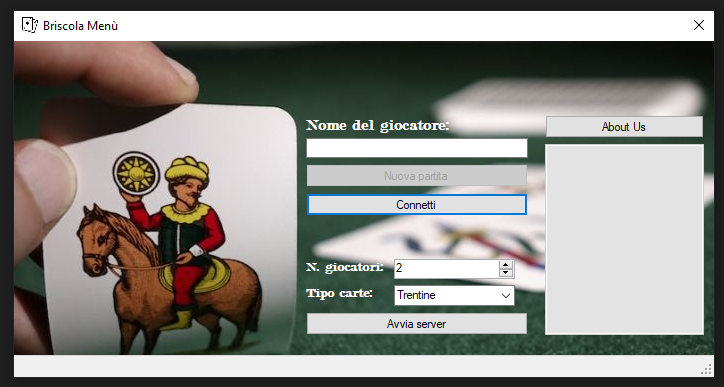

# Briscola-Windows-Forms-Csharp

You need 2 instances of [WFBriscola.exe](https://github.com/GabBen1300/Briscola-Windows-Forms-Csharp/blob/main/WFBriscola/bin/Debug/WFBriscola.exe).

On one instance, start the server, enter your name and connect, on the other, enter the player name and connect, as soon as the start game button is available, click it and start the game

